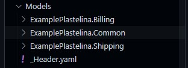
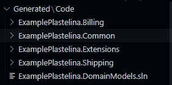
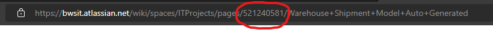
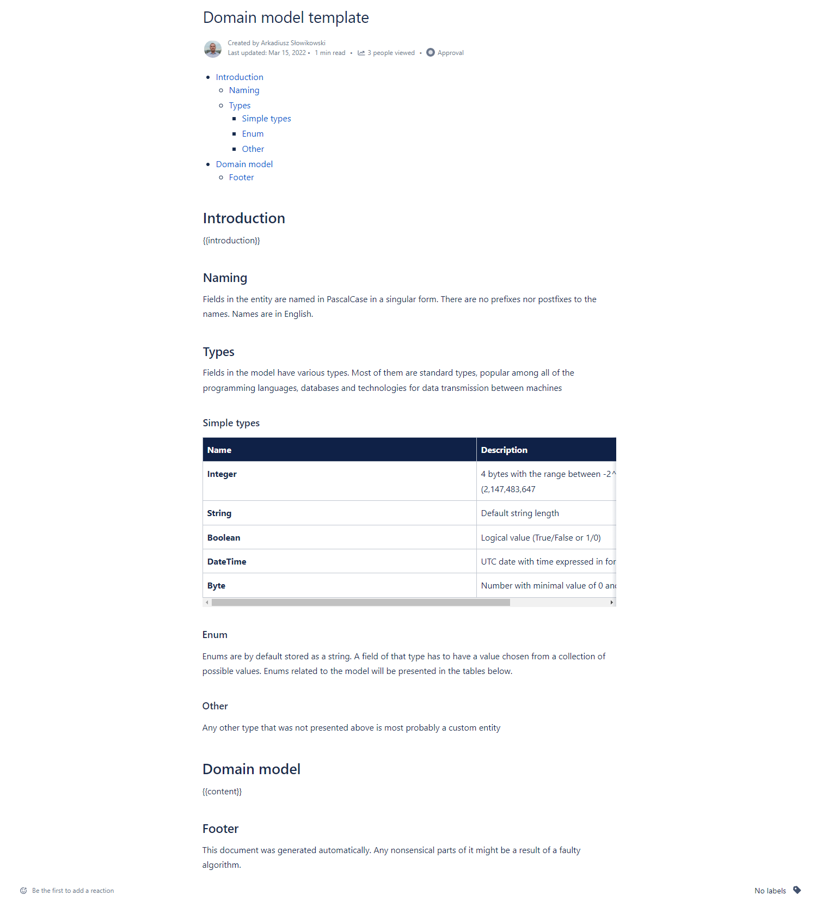

# 1 Description

This project is meant to make a single source of truth for models used in asynchronous communication (because I'm using here AsyncAPI. I image you could make it work with OpenAPI as well, somehow). The basic idea is that you'd make model definitions in yaml files as you'd normally make them for the purpose of AsyncAPI docs generator, but instead of getting just the docs, you are also getting a whole C# solution. This of course comes with some limitations in regards of AsyncAPI, but I reckon it's not something unbearable. In addition to AsyncAPI docs and C# code, you can also generate Confluence documentation and upload it straight to you server, as well as generate Word documentation.

Having a tool like this one help keeping all of the technical and business docs updated.

The projects are by default generated in .NET Standard 2.0 to make NuGets possible to share with as many solutions as possible.

In the main directory you can also find our pipelines - `bppr.yml` and `publish.yml` that we use on regular basis in our project.

# 2 Setup

Make sure you take a look at `consts.ts` and change both `solutionName` and `staticProjects` to something that's going to make sense in your case.

There're three files that you're meant to run in any case:

- `run_local.ts` - used in `generate.ps1` script. Used for local stuff - validation, code generation.
- `run_bppr.ts` - used in BPPR. Pretty much just validates stuff. Used in the `bppr.yaml` file.
- `run_publish.ts` - used during 'release'. Generates AsyncAPI, Confluence and/or Word documentations. In `publish.yaml` there are steps that publish the AsyncAPI and Confluence docs.

Obviously you don't have to use those files. You can modify them anyhow you want, dependingly on your needs. I can happen to use those scripts in my current project.

<b>Disclaimer:</b> In the whole project there's no logic for actually uploading the Word docs to GetOrganized, because in my project there's no use for Word docx, since we use Confluence. That's also probable there're some bugs in WordDocsGenerator (however I don't think so, I've tested it quite a bit). It was more of a 'nice to have' for me.
And since it's not so obvious (because it's .NET Frameword unfortunately), I have included in the `run_publish.ts` a couple of files of code that would build and execute the project via command line.

## 2.1 Arguments for run_local.ts

There're three arguments that will change the way Plastelina renders C# classes:

- `--constructors` - will generate three kinds of constructors in your classes: a default constructor, a constructor with only required fields and a constructor with all of the fields.
- `--private-setters` - all of the setters in properties will be private, so you can only set them via constructor.
- `--default-values` - will generate properties with default values, if there are going to be any specified. By default, default values won't be generated even if you put them in .yaml file. `default` field in a models definition is a part of AsyncAPI standard.

None of those are currently provided in `run_local.ts`.

# 3 Executing

When you need to update any class model, only make changes in YAML files in \Models and update version in \Models\\<your_model_folder\>\\\_meta.yaml.

<b>During the generation there’re going to be created <i>\_\_do_not_commit_me\_\_.yaml</i> and <i>\_\_business_docs\_\_temp\_\_.json</i> files that you should not index in git (you can, but why would you?).</b> The first one contains all models merged into one file, which are needed only for a couple of things - there’s no need to keep it around. The other one is for generating Confluence or Word docs. The files will be automatically removed.

To apply changes follow instruction below:

- Install any contemporary .NET SDK
- Download and install Node.js Download | Node.js (nodejs.org)
- Install TypeScript npm i typescript -g,
- Install TypeScript execution engine and REPL for Node.js npm i ts-node -g,
- Move to 'src' folder cd src,
- Install required modules npm i,
- Move back to main folder cd ..,
- Run script called generate.ps1 pasting full path into your terminal window.
- Commit changes to the repository.

The script will merge all model files and validate merged file. Also it will make changes in projects - add new, remove unnecessary and modify references. It will take care of C# classes too. Because of that you don’t have to change anything else.

# 4 Extending models

## 4.1 Models



All models are stored in “Models” directory. They are split into directories indicating domains. Each subfolder in “Models” (only those folders, not those nested deeper) is going to get a separate folder with code and a .csproj file. If you want to add a new class or a new enum, just go ahead and add a new file in the place you think the best fits in your case. If you want to add a domain or a domain model to a domain, add a folder.

“Models” directory also contains file \\\_Header.yaml. This one is not being turned into a .cs file and contains metadata needed for NuGet publishing and Async-API docs generation.

## 4.2 Code

If your Models directory looks like this:


- Models
  - A
    - 0.yaml
  - B
  - C
    - 2.yaml
  - D
    - 3.yaml
    - 5.yaml
    - 6.yaml



Then your Code directory is going to be generated into something like that:

- Generated
  - Code
    - A
      - 0.cs
      - A.csproj
    - B
    - C
      - 2.cs
    - D
      - 3.cs
      - 5.cs
      - 6.cs
      - B.csproj
    - ExamplePlastelina.DomainModels.sln

As you can see, there're also projects and a solution in the Code directory. Projects are created for all subfolders of Models folder, and only for them. There're no projects being created for folders nested deeper in the hierarchy. Each of the created projects are referenced in the .sln file as well.

In the Code directory there’s one folder that doesn’t exist in Models directory - BWS.Extensions. It’s something that we call a ‘static’ project - it’s not touched by Plastelina ever. You can reference it in your models.

## 4.3 Creating new model

All models are stored in .\Models directory. They are split into directories indicating domains. Each .\Models subfolder (only those folders, not those nested deeper) is going to get a separate folder with code and a .csproj file.

In model folder we must add one main model file that should also have channels and messages defined in the same file as it is in an example under instruction.

Channels and messages won’t be generated as C# code in any form, but they must be defined in a main model file.

### 4.3.1 Adding a new model

Create new folder in \Models - i.e.: {domain}.{name}

Create main model yml file(s) - {name}Model.yaml. There might be more than one in a single project.

Create submodel files - they shouldn’t have neither channels nor messages, because they are a part of the main one.

### 4.3.2 Model file structure

Class:

```yaml
components:
    schema:
        <<namespace>>:
            <<class name>>:
                description: <<**[Optional]** A description of the class used for HTML docs, confluence docs and for summaries in C# code>>
                nugets:
                    - <<Name of a nuget package that you want to install. You might specify a specific version you want to install. Later the contents of this list is going to be placed in "dotnet add package <<list value>>" commands, so keep it compatible>>
                references:
                    - <<Name of a project to which you want to add a reference in this model's project. Values from this list are going to be used in "dotnet add reference <<list value>>" commands, so keep it compatible>>
                usings:
                    - <<Literally strings that are going to be written later on at the top of your class. "using <<value>>;"
                type: object
                properties:
                    type: <<Property's type. For asyncapi's purposes it might be one of: 'string', 'number', 'boolean', 'array'>>
                    format: <<If your property is something other that those above, then put it here. It's going to override the 'type' field during generation. Might be one of: 'string', 'integer', 'number', 'decimal', 'boolean', 'double', 'date-time', 'date', 'time'. Anything else will be taken literally. Also used when you want to i.e. specify a class' name with it's namespace, like 'ExamplePlastelina.Common.Value', instead of just 'Value'>>
                    $ref: <<If your property is not a primitive type, you use this field to specify the path to the reference. I.e. '#/components/schema/ExamplePlastelina.Common/Value'. Cannot be used with 'type' field>>
                    description: <<Field's description. Used in HTML docs, confluence docs and C#'s summary>>
                    items:
                        <<If the prop is of type 'array' then you put here exactly the same structure as you put in 'properties' field>>
```

Enum:

```yaml
components:
  schema:
    <<namespace>>:
      <<enum name>>:
        description: <<**[Optional]** A description of the enum used for HTML docs, confluence docs and for summaries in C# code>>
        type: string
        enum:
          - <<Name of a member>>
```

Additionally, if a class is the main model class (basically the objects of this class are being transferred from one place to another), then it’s file also needs #/channels and #components/messages entries for the sake of asyncapi HTML docs.

```yaml
channels:
  <<inbound queue name>>:
    description: The queue by which <<your model name>> are delivered to DIP
    subscribe:
      summary: Receive a <<your model name>> from the outside
      message:
        $ref: "#/components/messages/<<your message name with the word 'Model' changed to 'Message'. I.e 'WarehouseReceiptModel' -> 'WarehouseReceipt Message'>>"

  <<outbound queue name>>:
    description: The topic by which <<your model name>> are sent out from DIP
    publish:
      summary: Send a <<your model name>> from the domain layer to a subscribing service
      message:
        $ref: '#/components/messages/<<your message name from the line 7>>'

components:
  messages:
    <<your message name from the line 7>>:
      name: <<your model name>>
      title: <<your model name>>
      summary: <<your model name>> description
      contentType: application/json
      payload:
        $ref: '#/components/schemas/<<namespace>>/<<your model name>>'
```

Under that, in the same file, put your model.

### 4.3.3 Inheritance in models

Accordingly to AsyncAPI's standard, it's possible to do something like this:

```yaml
components:
    schema:
        ExamplePlastelina:
            MyClass:
                allOf:
                  - $ref: '#/components/schema/ExamplePlastelina/ClassA'
                  - description: ...
                    properties: ...
                    ... <<model definition>> ...
```

Which means that the current model is a sum of all of those given. I tried to convert that into C# inheritance, but had to put some limitations on it. You can put only two models in `allOf` - one as a `$ref` and another one verbatim. As a result you'd get something like:

```csharp
public class MyClass : ClassA
```

Remember to put the namespace of `ClassA` into `usings` in your model definition.

## 4.4 Version

A current version of a package lies in the main folder of that package in \\Models directory.

```yaml
version: 0.0.1-alpha.2
description: Super duper package with lots of cool features
```

Whatever you put into `version` is going to be rendered in `<Version>` tag in .csproj files. Analogically, the same will happen to `description` and `<Description>`.

## 4.4.1 NuGets

```yaml
components:
  schemas:
    ExamplePlastelina.DomainModels:
      Model:
        type: object
        nugets:       <------------
          - Newtonsoft.Json
          - Serilog
        properties:
          Name:
            type: string
            [...]
          [...]
```

After being done with rendering code to files, Plastelina will add those NuGet packages that aren’t added to projects yet (if the result of `dotnet list package` doesn't contain the NuGet package's name). It collects all nugets entries, removes duplicates (it won’t add the same Newtonsoft.Json package twice) and runs `dotnet add <<projPath>> package <<nugetName>>`, so the names you put here must be the exact NuGet packages names. You might also add version.

## 4.4.2 Referenced projects

```yaml
components:
  schemas:
    ExamplePlastelina.DomainModels:
      Model:
        type: object
        references:       <------------
          - Newtonsoft.Json
          - Serilog
        properties:
          Name:
            type: string
            [...]
          [...]
```

After being done with saving code to files, Plastelina will add those projects that aren’t added as reference yet (if the result of `dotnet list reference` doesn't contain the NuGet package's name). It collects all references entries from a project, removes duplicates and runs `dotnet add <<projPath>> reference <<refProjectName>>`.

## 4.4.3 Usings

```yaml
components:
  schemas:
    ExamplePlastelina.DomainModels:
      Model:
        type: object
        usings:       <------------
          - Newtonsoft.Json
          - Newtonsoft.Json.Converters
          - ExamplePlastelina.DomainModels.Common
        properties:
          Name:
            type: string
            [...]
          [...]
```

While generating code, Plastelina will take every entry from usings and put them at the top of your file as simple C# usings - `using <<entry>>;`

## 4.4.4 Required properties

required list on a model contains names of properties that are mandatory. It’s going to be used in asyncapi HTML docs, confluence docs and in C# code. If a property is required, then Plastelina will not generate it as nullable (will skip ? after it’s name. Objects are still going to be nullable of course). Additionally it’s going to add [JsonProperty(Required = Required.Always)] to the property (as well as Newtonsoft.Json package and appropriate usings).

Enums can’t contain `required` field.

```yaml
components:
  schemas:
    ExamplePlastelina.DomainModels:
      Model:
        type: object
        properties:
          MyImportantProperty:
            type: string
        required:
          - MyImportantProperty
```

A required field is also added as a parameter to a constructor with only required properties.

### 4.4.5 Attributes

To add attributes to property you have to add new field attributes and enter a new attribute. You can put this field on properties and on classes. There are a couple of ways of declaring attributes. There a couple of approaches to it.

- 1

```yaml
components:
  schemas:
    ExamplePlastelina.DomainModels:
      Model:
        type: object
        attributes:
          - name: MyAttribute
            parameters:
              - value: typeof(DateTime)
        properties:
          MyImportantProperty:
            type: string
        required:
          - MyImportantProperty
```

Will give you

```csharp
namespace ExamplePlastelina.DomainModels
{
    [MyAttribute(typeof(DateTime)]
    public class Model
...
```

- 2

```yaml
components:
  schemas:
    ExamplePlastelina.DomainModels:
      Model:
        type: object
        attributes:
          - name: MyAttribute
            parameters:
              - name: Param
                value: 123
        properties:
          MyImportantProperty:
            type: string
        required:
          - MyImportantProperty
```

Will give you

```csharp
namespace ExamplePlastelina.DomainModels
{
    [MyAttribute(Param = 123)]
    public class Model
...
```

- 3

```yaml
components:
  schemas:
    ExamplePlastelina.DomainModels:
      Model:
        type: object
        attributes:
          - name: MyAttribute
            parameters:
              - name: Param
                value: abc
                type: string
        properties:
          MyImportantProperty:
            type: string
        required:
          - MyImportantProperty
```

Will give you

```csharp
namespace ExamplePlastelina.DomainModels
{
    [MyAttribute(Param = "abc")]
    public class Model
...
```

- 4

```yaml
components:
  schemas:
    ExamplePlastelina.DomainModels:
      Model:
        type: object
        attributes:
          - name: MyAttribute
            parameters:
              - value: typeof(DateTime)
              - name: Param1
                value: 'abc'
        properties:
          MyImportantProperty:
            type: string
        required:
          - MyImportantProperty
```

Will give you

```csharp
namespace ExamplePlastelina.DomainModels
{
    [MyAttribute(typeof(DateTime), Param = "abc")]
    public class Model
...
```

<b>Attributes are not mentioned in AsyncAPI, Confluence and Word docs.</b>

A `[JsonProperty(Required = Required.Always)]` property will be rendered for each required property.

### 4.4.6 DateTime

To add property of type DateTime we need to define type as string and add format as date-time. Example:

```yaml
components:
  schemas:
    ExamplePlastelina.DomainModels:
      Model:
      type: object
      properties:
        Date:
          format: date-time
          type: string
```

Generates

```csharp
using System;

namespace ExamplePlastelina.DomainModels
{
    [MyAttribute(typeof(DateTime), Param = "abc")]
    public class Model
    {
        public DateTime? Date { get; set; }
...
```

### 4.4.7 Collections

Collections are generated as IEnumerable<T>. To add property of this type set type as array, add items which can be reference to other schema or type.

```yaml
components:
  schemas:
    ExamplePlastelina.DomainModels:
      Model:
        properties:
          MyField:
            type: array
            items:
              type: string
```

Renders `public IEnumerable<string>? MyField { get; set; }`

AsyncAPI allows to define multiple types of items in an array, but that's not really possible in C#. You could use `dynamic` or `object`, but it's a terrible practice.

```yaml
components:
  schemas:
    ExamplePlastelina.DomainModels:
      Model:
        properties:
          MyField:
            type: array
            items:
              $ref: '#/components/schemas/ExamplePlastelina.DomainModels.Common/MyEnum'
```

Renders `public IEnumerable<MyEnum>? MyField { get; set; }`

There shouldn’t be a reason for making IList<T> fields in models, but that functionality might be added later if really needed. Otherwise you can just go ahead and replace all instances of `IEnumerable` in the project with `IList`.

### 4.4.8 Primitive types

Declaring types for numbers relies on setting the correct type. Look at the examples below.

| Type   | Format                                                                       | Result                                         |     |     |
| ------ | ---------------------------------------------------------------------------- | ---------------------------------------------- | --- | --- |
| number | <none>                                                                       | double                                         |     |     |
| number | double                                                                       | double                                         |     |     |
| number | long                                                                         | long                                           |     |     |
| number | integer                                                                      | int                                            |     |     |
| number | float                                                                        | float                                          |     |     |
| number | decimal                                                                      | decimal                                        |     |     |
| string | <none>                                                                       | string                                         |     |     |
| string | date-time or date or time                                                    | DateTime                                       |     |     |
| \$ref  | #/basically/anything/you/want/only_the_thing_after_the_last_slash_is_printed | only_the_thing_after_the_last_slash_is_printed |     |     |

### 4.4.9 Descriptions

```yaml
components:
  schemas:
    ExamplePlastelina.DomainModels:
      Model:
        description: my model description
        type: object
        properties:
          PoNumbers:
            description: my property description
            type: array
            items:
              $ref: '#/components/schemas/ExamplePlastelina.DomainModels.Common/string'
```

Will result in

```csharp
namespace ExamplePlastelina.DomainModels;

/// <summary>
/// my property description
/// </summary>
public class Model
{
    /// <summary>
    /// my property description
    /// </summary>
    public IEnumerable<string>? PoNumbers { get; init; }
}
```

# 5 Business documentation

Confluence and Word documentation generators read data from <i>\_\_business_docs\_\_temp\_\_.json</i> file. It's generated via `BusinessDocumentationDataGenerator` in TypeScript. It's already in `run_publish.ts`.
This documentation is way more high level and resembles something like a D0130 - Logical Model docs.
In my case, I generate Confluence docs in a release pipeline, so the `run_publish.ts` contains all that is required for that to work. I also put two lines that would generate Word docs, but I don't use it on regular basis.
Business docs generators basically replace a couple of strings in templates and generates tables with classes/enums.

## 5.1 Confluence

You have to make the pages for the docs manually and provide their content Ids in yamls.

### 5.1.1 In yaml model

Class model schema may contain `confluencePageContentId`. If this field is filled the script will generate content about the model and the page with given id will be updated. The page must be created before running the script. Confluence pages contains high level knowledge which can be used during dialogs with takeholders.


That’s the page content id.

Generator takes i.a. description and properties.

```yaml
components:
  schemas:
    ExamplePlastelina.DomainModels:
      Model:
        confluencePageContentId: 592150950
        description: The models described below are models that are used in DIP to transmit data regarding warehouse purchase orders from Magaya to Compass.
        properties: ...
```

### 5.1.2 Confluence page template

You need a template for that documentation. The generator will only replace two words:

- `{{introduction}}` - will be replaced with the `description` field from a model's definition
- `{{content}}` - will be replaced with tables generated from models' and enums' definitions

The title of the page is going to be set to "<model's name> [Auto generated]"

My template looks like this:



### 5.1.2 Confluence generator setup

In the `publish.yml` pipeline you can see how we publish the docs. In order to make publishing Confluence docs work you have to run `run_publish.ts` with a couple of arguments:

- `--business-docs-path` - path to the file with required data. By default <i>Generated\\\_\_business_docs\_\_temp\_\_.json</i>
- `--template-content-id` - refer to #5.1.1.
- `--host` - Confluence to which you want to upload stuff. In my case it's `https://bwsit.atlassian.net/wiki`
- `--username` - some username
- `--api-token` - an API Token created on the account with username provided above

## 5.2 Word

It takes quite a bit of time. I'm using the Interop package for this, so it's quite slow.

### 5.1.2 Word page template

You can find the template at src/assets.
The generator looks for a couple of words:

- `{{title}}` - will be replaced with "<model's name> [Auto generated]"
- `{{introduction}}` - will be replaced with the `description` field from a model's definition
- `{{content}}` - will be replaced with tables generated from models' and enums' definitions

### 5.1.2 Word generator setup

In `run_publish.ts` I've put a couple of instructions that would generate the docs. It doesn't really do much more other than generating them in the repo, which I image is not the best idea, but I had to reason to do otherwise.

You have to provide a couple of arguments to the generator:

- `--business-docs-path` - path to the file with required data. By default <i>Generated\\\_\_business_docs\_\_temp\_\_.json</i>.
- `--template-path` - by default it's src/assets/D0130Template.docx. There's no need to change it.
- `--destination-directory` - by default Generated/WordDocs. Feel free to change it.

# 6. Publishing AsyncAPI documentation

`run_publish.ts` generates also the AsyncAPI docs using merged models from <i>Generated\\\_\_do_not_commit_me\_\_.yaml</i> file. The results of that will be in Generated\\html directory. In `publish.yml' you can see how we publish that to a storage account.

Prerequisites global install: `@asyncapi/generator`, `ts-node`, `typescript`

# 7 Generating C# classes, projects, .gitignore and the solution

Destination path for generated files is \Generated\Code folder. If .gitignore and solution do not exist, they will be generated, otherwise generator will update them. If there is a change in model, the script will update files where changes were made for classes, projects, and the solution. If any folder will be added the script will generate a new one in \Generated\Code also it is the same process for removing - if you remove folder from \Models it will be removed from \Generated\Code. Projects have references to other projects if there is a dependency. The solution in \Generated\Code have a reference to each project.

# 8 Publishing NuGet

You can have a peek at my way of publishing NuGets in `publish.yml` release pipeline.
